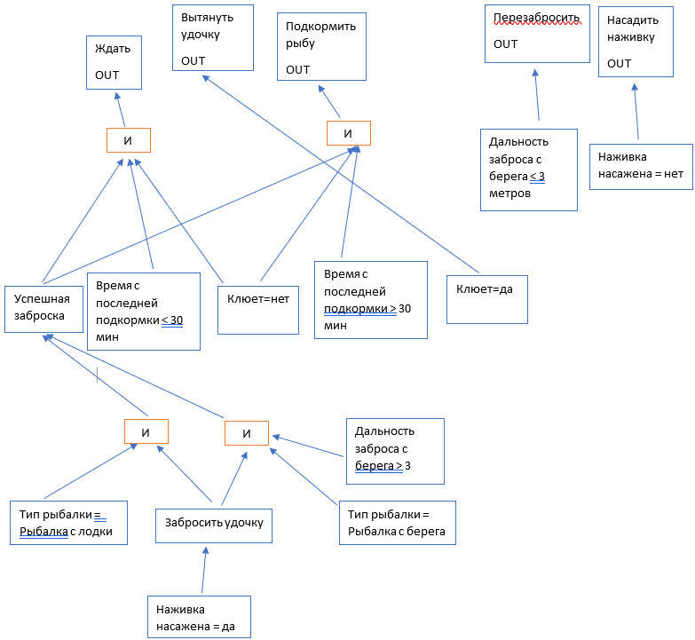

# Отчет по лабораторной работе
## по курсу "Искусственый интеллект"

### Студенты:

| ФИО       | Роль в проекте                     | Оценка       |
|-----------|------------------------------------|--------------|
| Бронников | Реализовал оболочку ЭС на python |  |
| Вельтман | Обработка ответов, механизм вывода |  |
| Днепров| Механизм задания вопросов, тестирование |  |
| Живых | Инженер по знаниям, заполнение базы данных, описал общую схему предметной области |  |
А еще мы все приложили руку к этому отчёту.

## Результат проверки

| Преподаватель     | Дата         |  Оценка       |
|-------------------|--------------|---------------|
| Сошников Д.В. |     27.05.2020         |    4.8           |

> *Сама по себе экспертная система крайне простая и короткая, что не позволило вам почувствовать процесс извлечения знаний на практике. То, что разраблали сами оболочку - молодцы, полезный опыт. Было бы хорошо прикрутить бот-оболочку.*

## Тема работы

Нам было задано придумать предметную область и на ее основе реализовать собственную экспертную систему, которая помогала бы пользователям решать поставленные задачи. В качестве темы мы решили выбрать рыбалку. С помощью нашей экспертной системы любой человек сможет успешно порыбачить, даже не имея никого опыта в данном деле. На основе входных данных, вводимых пользователем, экспертная система подбирает наиболее оптимальное решение, которое поможет пользователю поймать больше рыбы и как следствие лучше прочувствовать удовольствие от рыбалки.

## Концептуализация предметной области

Описание концептуализации предметной области:
 - выделенные понятия:
 	1) дальность броска
	2) наживка насажена
	3) время подкормки
	4) клюет
	5) тип рыбалки
	6) успех заброски
	7) забросить удочку
 - тип получившейся онтологии - иерархия
 - статические знания

Приведите графические иллюстрации:


## Принцип реализации системы

Для реализации проекта мы выбрали язык Python, поскольку мы хотели разработать проект на языке, с которым мы все хорошо знакомы и который достаточно гибок для реализации подобных проектов.

Наша система состоит из 2 частей:
 - **Оболочка экспертной системы**, которая работает непосредственно с базой знаний и отвечает за поиск результата на основе правил из базы знаний и фактов, переданных ей от польователя через пользовательский интерфейс.
 - **Пользовательский интерфейс**, который разрабатывался непосредственно для конкретной базы знаний и реализует удобное общение общение с пользоваетелем.

### Оболочка экспертной системы

Нам было интересно разобраться с тем, как устроенны оболочки для экспертных систем, поэтому было решено написать собственную на языке *Python*, способную к гибкой интерпретации различных баз данных и работы с ними.

Оболочка считывает базу данных из файла, обрабатывает её, после чего готова к работе с ней. База знаний должна быть описана в опредлённом формате и иметь 2 основных объекта: *переменная*, которая должна быть объявлена, и *правило*, посредством которых оболочка выводит значения переменных на основе фактов и значений дргих переменных.

Оболочка реализует обработку файла следующим образом:

 - Считывает переменную из файла, после чего создает новый объект класса *Variable* и сохраняет его  в словарь по ключу - имени переменной, который должен быть уникальным в базе знаний. Пример объявления переменных в файле:
 ```
var: int ВремяПодкормки askable
var: bool УспешнаяЗаброска

```
 - При считывания правила, которое относится к определенной переменной, объявленной ранее, создает новый объект *Rule*, который сохраняется в спике правил переменной, для которой написано это правило.
  Все правила в базе записываются в виде булевой функции над множеством элементарных сравнений в совершенной дизьюктивной нормальной форме (сумма произведений сравнений) следующим образом: сумма произведений  эквивалентна нескольким правилам, состоящим из произведений, а сами произведения - сравнения, перечисленные через запятую. Пример правил в файле:
 ```
 rule: УспешнаяЗаброска True <= ТипРыбалки == "Лодка", ЗаброситьУдочку == True
 rule: УспешнаяЗаброска True <= ДальностьЗаброса > 2, ТипРыбалки == "Берег", ЗаброситьУдочку == True

 ```
 Такие правила разбиваются  на состовлющие - сравнения, которые внутри реализации хранятся в списке.

 - Также есть возможность задать некоторым переменным константные значения следующим образом:
 ```
 set: ВремяПодкормки 14
 ```

 После обработки базы знаниий оболочка осуществляет работу с пользовательским интерфейсом посредством *API*. Основными действиями при работе с оболочкой является задание значений переменным *set_value*, на основе которых будет производится поиск значений других переменных на основе правил, и непосредственно сам вывод этих значений get_value("имяпеременной").

Для вывода значений оболочка:
- Принимает соответствующий запрос на поиск значения, содержащий имя переменной.
- Оболочка находит переменную в словаре всех переменных и вызывает метод *get_value*, котрый работает рекурсино и сначала пытается найти значение этой переменной во временном хранилище, предназначенном для заданных через оболочку значений и хранения значений уже подсичтанных переменных, после чего начинает проверять на истинность правила, соответствующие этой переменной, которые хранятся в списке rules до первого сработавшего. Если не сработало ни одно правило, возвращается *None*.
- Каждое правило хранится в объекте класса *Rule* и проверяет в себе выполнение всех сравнений, при истиннойсти котрых возвращает *True*. Иначе *False*.
- Каждое сравнение для проверки корректности значения вызывает метод *get_value*  у переменной, с которой он связан. После чего происходит соответствующее сравнение полученного значения посредством *lambda* функции.

В итоге оболочка при запросе значения переменно либо вернет обратно значение, либо вернет None, что означет недостаточное количесвто фактов для определения значения.

Также во время поиска значений оболочка сохраняет историю поиска, что составляет описание того, как она принимала решения. История для последнего успешного вызова хранится в оболочке в виде вложенных словарей, и может быть получена соответствующей командой *get_last_history*. Однако приведение ее в читаемый вид - дело рук программиста, который использует оболочку для своих программ.

Для очистки всех заданных пользователем значений и промежуточных вычислений в оболочке реализована команда *clear_storage*

Демонстрация работы API в Python интерпретаторе:

```
>>> from system_shell import SystemShell
>>> shell = SystemShell()
>>> shell.compile_file("fishing.max")
>>> shell.get_askable()
[('ДальностьЗаброса', 'int'), ('НаживкаНасажена', 'bool'), ('Клюет', 'bool'), ('ВремяПодкормки', 'int'), ('ТипРыбалки', 'str')]
>>> shell.set_value("ДальностьЗаброса", 4)
>>> shell.get_value("Действие") == None
True
>>> shell.clear_storage()
>>> shell.set_value("ДальностьЗаброса", 1)
>>> shell.get_value("Действие")
'Перезабросить'
>>> shell.get_last_history()
{('Действие', '=', 'Перезабросить'): {('ДальностьЗаброса', '<', 3): {}}}
>>> shell.clear_storage()
>>> shell.set_value("НаживкаНасажена", True)
>>> shell.set_value("Клюет", False)
>>> shell.set_value("ВремяПодкормки", 14)
>>> shell.set_value("ТипРыбалки", "Лодка")
>>> shell.get_value("Действие")
'Ждать'
>>> shell.get_temp_storage()
{'НаживкаНасажена': True, 'Клюет': False, 'ВремяПодкормки': 14, 'ТипРыбалки': 'Лодка', 'ЗаброситьУдочку': True, 'УспешнаяЗаброска': True, 'Действие': 'Ждать'}
>>> shell.get_value("УспешнаяЗаброска")
True
```

## Пользовательский интерфейс и функции ввода

Механизмы задания вопросов, обработки ответов и вывода, реализованы в функции q_and_a.
```
def q_and_a(interf):
	criteria = None
	while (criteria == None):
		user_action, choice = interf.question(interf)
		criteria = inner(user_action, choice)
	parsing(criteria)
	interf.additional_question()
```
Для задания вопросов используется метод question класса Interface.
```
def question(self, obj):
  function = [obj.bait, obj.fishing_place, obj.distance, obj.fishing_time, obj.fish_action]
  lst = function[self.index]()
  self.index += 1
  self.history.append(lst)
  return lst
```
 В нашей реализации необходим некий порядок задания вопросов, для чего используется переменная index. В вопросе о типе рыбалки, в соответствие с ответом пользователя может быть "отсечена" ветка возможного решения, делается это при помощи инкрементирования index.

 ```
 def fishing_place(self):
 action = "ТипРыбалки"
 print("Рыбачишь с берега 🌴 или с лодки 🛥?")
 print("1. Берег")
 print("2. Лодка")
 answer = input().lower()
 if answer in self.true_ans:
   answer = "Берег"
 elif answer in self.false_ans:
   answer = "Лодка"
   self.index += 1
 else:
   while True:
     print("Я тебя не понял 🤯, \"с бегера\" или \"с лодки\"")
     answer = input().lower()

     if answer in self.true_ans:
       answer = True
       break
     elif answer in self.false_ans:
       answer = False
       break
 return action, answer
```
Проверка ответов пользователя производится благодаря двум спискам с отрицательными ответами и положительными, если ни один из ответов не подходит, то вызываем исключение с помощью raise.
Главная функция q_and_a будет работать, пока критерий (criteria), отвечающий за действие, которое должен выполнить пользователь, который решил опробовать нашу ЭС, не будет равен конкретному значению (например, "Насадить" или "Перезабросить"). Получаем это значение как возвращаемое значение из метода inner.
```
def inner(user_action, choice):
	shell.set_value(user_action, choice)
	return shell.get_value("Действие")
```
Здесь мы получаем в качестве аргументов функции действие пользователя и его выбор, обращаемся к оболочке ЭС с этими значениями, чтобы загрузить их в нее. Возвращаем из оболочки значение действия, которое предстоит выполнить пользователю. Если значение действия отсутствует (None), значит необходимых знаний о действиях пользователя еще недостаточно и нужно продолжать задавать вопросы пользователю, чтобы сформировать для него ответ.

Конкретно метод parsing отвечает за механизм вывода. В него как раз и передается значение criteria (отвечает за действие, которое должен выполнить пользователь). В соответствие с его значением выдается ответ для пользователя.
```
def parsing(action):
	if action == "Насадить":
		print("Тебе нужно насадить наживку 🍤 на крючок!")
	elif action == "Перезабросить":
		print("Тебе нужно перезабросить удочку! 🌊")
	elif action == "Вытянуть":
		print("Тебе нужно вытянуть удочку! 🎣")
	elif action == "Ждать":
		print("Прояви терпение, тебе нужно немного подождать! ⏱")
	elif action == "Подкормить":
		print("Тебе нужно подкормить рыбу! 🐟")
	else:
		print("Я запутался 🤯")
  ```
Также у нас была реализована функция истории действий пользователя в методе additional_question. Благодаря additional_question наша ЭС может показать, каким образом она пришла к полученному ответу.

Функция написана таким образом, чтобы пользователь видел список своих действий, которые привели к конечному результату и рассуждения экспертной системы приведенные к человечному виду.

Вообще при разработке интерфейса мы пытались сделать его максимально весёлым и похожим на живое общение (в меру наших возможностей). И благодаря эмодзи и смешным ответам, надеюсь, нам это удалось.

### Отказоустойчивость интерфейса

Мы предусмотрели все сценарии воода пользователем некорректных данных и сделали так, чтобы в экспертную систему поступали только подходящие параметры, хотя внутри неё есть обработка исключенй, проще всего обрабатывать аномальное поведене пользователя в методах интерфейса.

## Извлечение знаний и база знаний

За извлечение из БЗ отвечает метод compile_file.
```
def compile_file(self, filename):
        with open(filename, "r") as fd:
            for line in fd:
                words = line[:-1].split(": ")
                if not words[0]:
                    continue
                if words[0] == 'rule':
                    self.add_rule(words[1])
                vs =  words[1].split()
                if words[0] == 'var':
                    self.add_var(vs)
                if words[0] == 'set':
                    self.add_set(vs)
```

База знаний состоит из переменных и правил, на ее основе экспертная система предлагает нам делать определнные действия при определенных обстоятельствах.

Сама база зананий:
```
var: str Действие
var: int ДальностьЗаброса askable
var: bool НаживкаНасажена askable
var: bool Клюет askable
var: int ВремяПодкормки askable
var: bool УспешнаяЗаброска
var: bool ЗаброситьУдочку
var: str ТипРыбалки askable


rule: Действие "Насадить" <= НаживкаНасажена == False
rule: Действие "Перезабросить" <= ДальностьЗаброса < 3
rule: Действие "Вытянуть" <= Клюет == True
rule: Действие "Ждать" <= УспешнаяЗаброска == True, ВремяПодкормки < 30, Клюет == False
rule: Действие "Подкормить" <= УспешнаяЗаброска == True, ВремяПодкормки > 29, Клюет == False

rule: УспешнаяЗаброска True <= ТипРыбалки == "Лодка", ЗаброситьУдочку == True

rule: УспешнаяЗаброска True <= ДальностьЗаброса > 2, ТипРыбалки == "Берег", ЗаброситьУдочку == True

rule: ЗаброситьУдочку True <= НаживкаНасажена == True
```

## Протокол работы системы
```
Hello 👋 there!
I'm general Obi-Wan Kenobi, and I gonna help you with fishing 🎣!
May the Force 💪 be with you!

Наживка 🍤 насажена?
1. Да
2. Нет
1
Рыбачишь с берега 🌴 или с лодки 🛥?
1. Берег
2. Лодка
из космоса
Я тебя не понял 🤯, "с бегера" или "с лодки"
с луны
Я тебя не понял 🤯, "с бегера" или "с лодки"
с берега
Какова дальность заброса ☄? (в метрах)
пять
Я тебя не понял 🤯, положительное введи число
Циферками!
-5
Я тебя не понял 🤯, положительное введи число
Циферками!
5
Сколько минут назад ты подкармливал рыбу? ⏱
не помню
Я тебя не понял 🤯, положительное введи число
Циферками!
6
Клюет? 🐟
1. Да
2. Нет
вроде
Я тебя не понял 🤯, введи "да" или "нет"
да
Тебе нужно вытянуть удочку! 🎣

Интересно почему тебе нужно сделать именно так? 🤔
1. Да
2. Нет
хм
Я тебя не понял 🤯, введи "да" или "нет"
да

Потому что:
        1. Ты насадил наживку. 😎
        2. Ты рыбачишь с берега. 🌴
        3. Ты замечательно закинул наживку. С берега это сделать не так уж и просто. 👍
        4. Рыба уже у твоей наживки и жадно пожирает подкормку. 🍤
        5. Клюёт, подсекай скорее! 🎣

Хочешь еще порыбачить?
да
Тогда начнем нашу рыбалку, мой юный падаван!
Наживка 🍤 насажена?
1. Да
2. Нет
1
Рыбачишь с берега 🌴 или с лодки 🛥?
1. Берег
2. Лодка
2
Сколько минут назад ты подкармливал рыбу? ⏱
55
Клюет? 🐟
1. Да
2. Нет
2
Тебе нужно подкормить рыбу! 🐟

Интересно почему тебе нужно сделать именно так? 🤔
1. Да
2. Нет
1

Потому что:
        1. Ты насадил наживку. 😎
        2. Ты рыбачишь с берега. 🌴
        3. Воможно, рыба уже всё съела и уплыла. 🐟 Посмотрим, клюёт или нет.
        4. Не клюёт, потому что корм закончился. 🍤 Нужно подкинуть еще что-нибудь.

Хочешь еще порыбачить?
нет
Жду тебя снова, мой юный падаван!
Да прибудет с тобой Сила! 💪
```
## Выводы

Данная лабораторная работа помогла развить не только наши знания в сфере искусственного интеллекта, но и коммуникационные умения. В связи с самоизоляцией из-за пандемии COVID-19 встретиться очно у нас не вышло, поэтому поддержание связи и разбор спорных моментов происходил в discord и соц.сети vk.com. В очередной раз мы убедились, как важно общаться и распределять обязанности в соответствии с предпочтениями и навыками участников.

Основной сложностью во время выполнения лабораторной работы было то, что во время разработки оболочки мы пошли не совсем корректным путем. Нам следовало бы использовать Prolog, так как нам нем было бы проще и эффективнее производить выводы правил и отсечение ветвей решений. Также нам пришлось отдельно разрабатывать синтаксис для базы знаний.

Создание экспертной системы показалось нам интересным заданием. А разработка интерфейса подняла настроение. В будущем, если нарастить базу знаний (например, учитывать геопозицию пользователя и скачивать данные о численности и видах рыб, обитающих в этом месте, ввести подходящие наживки для конкретной рыбы) и внедрить ЭС на другие платформы, то это может стать довольно полезным приложением-советником во время рыбалки.
