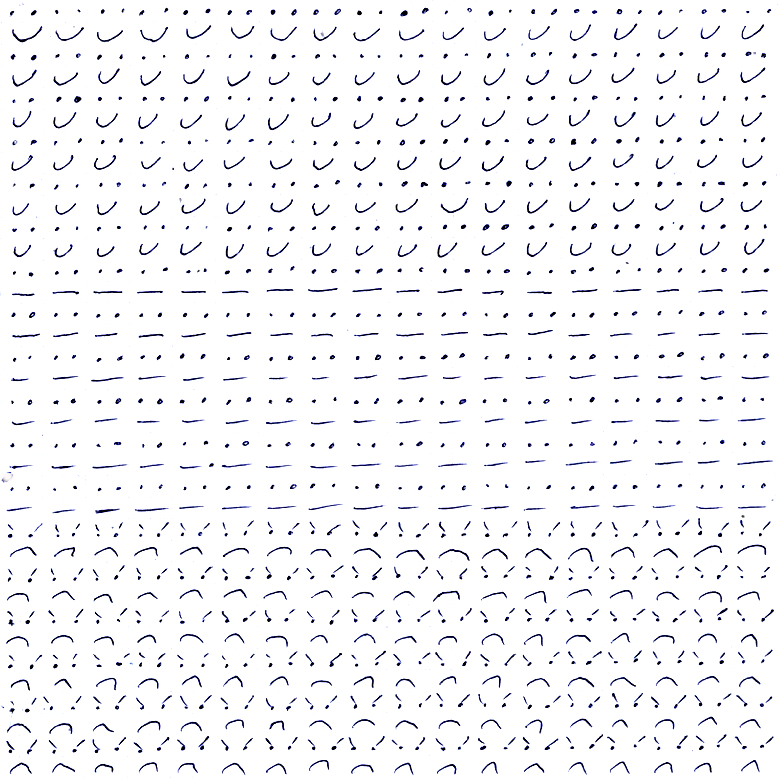
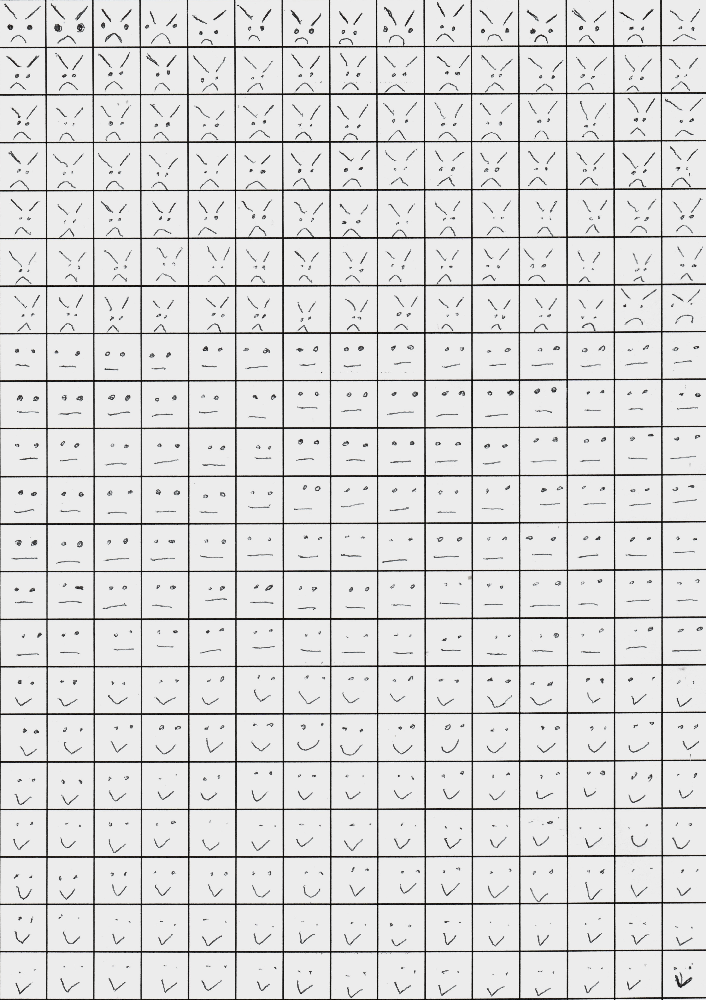
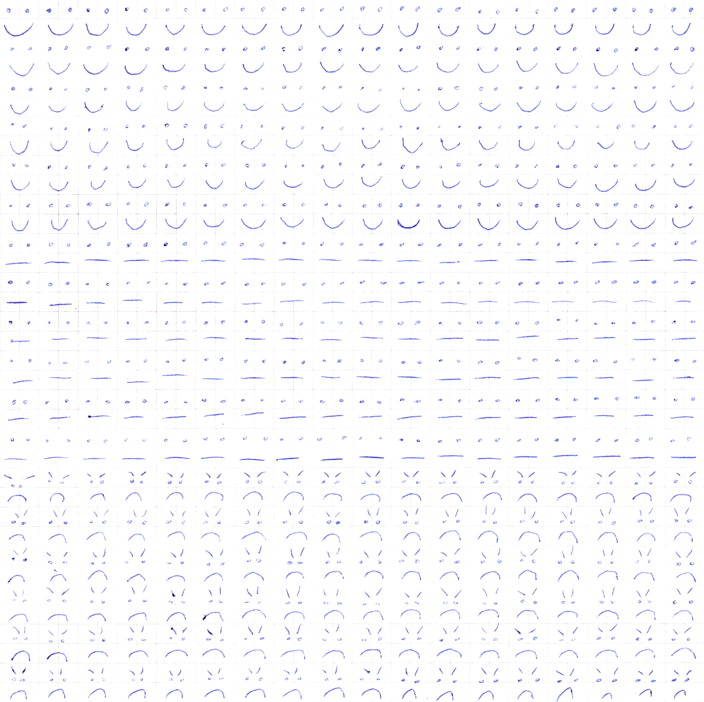
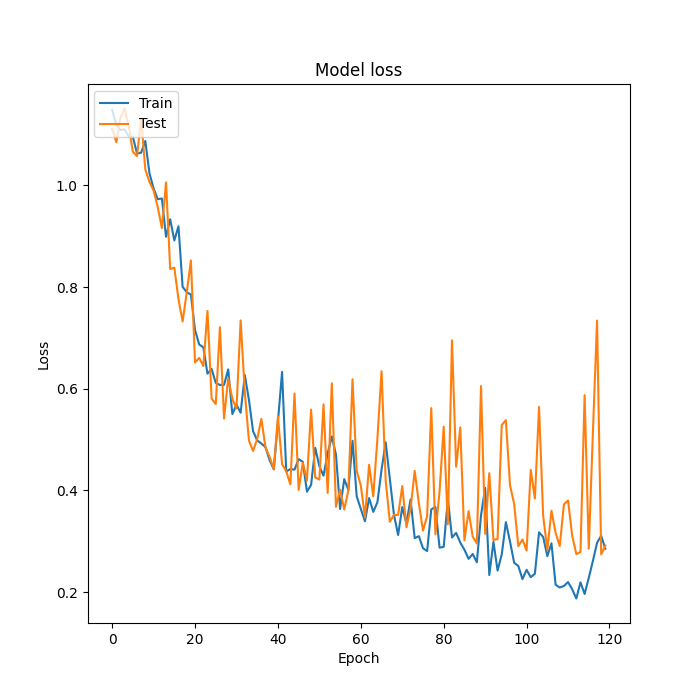
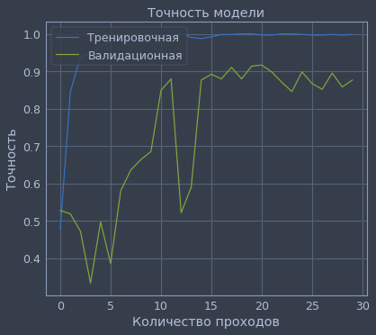
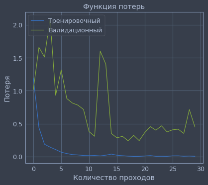
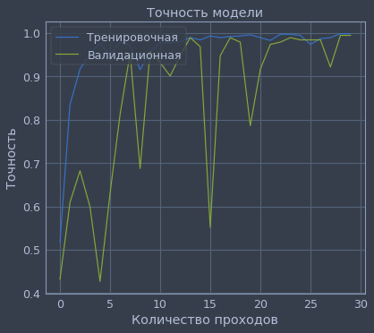
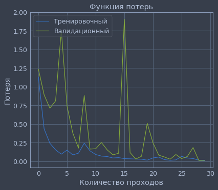

# Отчет по лабораторной работе 
## по курсу "Искусственый интеллект"

## Нейросетям для распознавания изображений


### Студенты: 

| ФИО       | Роль в проекте                     | Оценка       |
|-----------|------------------------------------|--------------|
| Бронников М.А. | Обучил свёрточную нейросеть |          |
| Вельтман Л.Я. | Обучила полносвязную однослойную и многослойную нейросеть |       |
| Корнеев Р.А. | Обработал и подготовил данные для обучения |      |

## Результат проверки

| Преподаватель     | Дата         |  Оценка       |
|-------------------|--------------|---------------|
| Сошников Д.В. |  27.05.2020            |    5           |

> *Было бы полезно задуматься о том, переобучается ли модель или недообучается.*

## Тема работы

Построение нейронных сетей для классификации рукописных символов: улыбающиеся, хмурящиеся и нейтральных смайлики.

## Распределение работы в команде

Перед работой в команде мы собрались в онлайн конференции и изучили сильные стороны каждого из участников. 

Мы решили, что на 1 человека должно получиться по 1 нейросети. Односвязную нейросеть мы классифицировали как частный случай полносвязной, поэтому их делал один человек - Лина. 

Обучение сверточной сети требует дополнительных знаний, поэтому ее обучать вызвался человек, который интересуется этой темой за пределами учебной дейтельности - Максим.

Обработка данных - самый важный процесс, который при этом требовал не таких глубоких познаний в программировании. Поэтому эту работу выполнил Рома, который обучается на 804 кафедре. Он умело восполнил некоторые пробелы в программировании своими знаниями *Photoshop* и *html*, что позволило нам красиво оформить наши ноутбуки и как можно качественне подготовить данные.

## Подготовка данных

Фотографии исходных листков с рукописными символами:




Фотографии были обработаны при помощи графического редактора. Они были обрезаны и в них увеличина контрастность, после чего ушла разлиновка на 2 из них. 

Подготовка датасета вместе с исходным кодом подробно описана в [Cuter.ipynb](Cuter.ipynb).

## Загрузка данных

Данный программный код позволил нам загружать наши датасеты, которые лежат в папке [data/](data/) и разбиты по именам участников, отрисовавших эмоджи.

```
def get_size(path, classes):
    size = 0
    for cl in classes:
        size += len(next(os.walk(path + cl))[2])
    ans = [size]
    one_path = path + classes[0] + '/' + next(os.walk(path + classes[0]))[2][0]
    one_im = cv2.imread(one_path)
    ans.extend(list(one_im.shape))
    return tuple(ans)

def img_data_reader(path, classes):
    if path[-1] != '/':
        path += '/'
    size = get_size(path, classes)
    X_cols = np.zeros(size).astype(np.uint8)
    Y_cols = np.zeros((size[0], len(classes))).astype(np.uint8)
    last_bound = 0
    for i in range(len(classes)):
        images = next(os.walk(path + classes[i]))[2]
        for j in range(len(images)):
            X_cols[last_bound + j] = cv2.imread(path + classes[i] + '/' + images[j])
            Y_cols[last_bound + j][i] = 1
        last_bound += len(images)
    return X_cols, Y_cols
```

## Обучение нейросети

### Полносвязная однослойная сеть

**Архитектура**

Однослойная нейронная сеть - сеть, состоящая из одного слоя.
Однослойный персептрон  - однослойная нейронная сеть, все нейроны которой имеют жесткую пороговую функцию активации.
Однослойный персептрон имеет простой алгоритм обучения и способен решать лишь самые простые задачи. Эта модель вызвала к себе большой интерес в начале 1960-х годов и стала толчком к развитию искусственных нейронных сетей.

*Проектирование сети*

```
model_one = M.Sequential()
model_one.add(L.Flatten())
model_one.add(L.Dense(output_dim = len(classes), input_shape=(k_size,), activation='softmax'))
```

Первый слой этой сети - Flatten. Слой извлекает строки пикселей из изображения и выстраивает их в один ряд. Этот слой не имеет параметров для обучения, он только переформатирует данные.

После разложения пикселей, нейросеть содержит один слой Dense. Это полносвязный нейронный слой. Первый (и последний) 3-узловой softmax слой возвращает массив из 3 вероятностных оценок дающих в сумме 1. Каждый узел содержит оценку указывающую вероятность принадлежности изображения к одному из 3 классов.


Компиляция модели происходит с использованием в качестве *loss-function* предназначенную для задач классификации *категориальную кроссэнтропию*, а для метода градиентного спуска *оптимизацию Адама*. 
В качестве метрики возьмем Accuracy = (TP + TN) / M, где  M - размер данных, поскольку в нашей задаче примерно равное количество объектов каждого из классов.

```
model_one.compile(
	loss='categorical_crossentropy',
	optimizer='adam',
	metrics=['accuracy']
)
```

**Результаты**

*Тренировка сети*

Обучим модель, при этом размер батча возьмем равным 50 и установим количество эпох обучения равное 120.

```
hist = model_one.fit(
	X_train_2,
	Y_train_2,
	batch_size = batch,
	epochs = epc,
	validation_data=(X_test_2, Y_test_2)
)
```

[Вывод терминала](logs/log0.txt)

Построим графики процесса обучения.
```
plt.plot(hist.history['accuracy'])
plt.plot(hist.history['val_accuracy'])
plt.title('Model accuracy')
plt.ylabel('Accuracy')
plt.xlabel('Epoch')
plt.legend(['Train', 'Test'], loc = 'upper left')
plt.show()
```
График функции точности обучаемой модели


```
plt.plot(hist.history['loss'])
plt.plot(hist.history['val_loss'])
plt.title('Model loss')
plt.ylabel('Loss')
plt.xlabel('Epoch')
plt.legend(['Train', 'Test'], loc = 'upper left')
plt.show()
```
График функции потерь обучаемой модели


Показатели качества модели на тренировочных и тестовых данных.
```
test_acc = model.evaluate(X_train_2,  Y_train_2, verbose = 2)
print("\nТочность на тренировочных(обучающих) данных: %.3f" % test_acc[1])
print("%s: %.3f" % (model.metrics_names[0], test_acc[0])) # loss (потери)


test_acc = model.evaluate(X_test_2,  Y_test_2, verbose = 2)
print("\nТочность на проверочных(тестовых) данных: %.3f" % test_acc[1])
print("%s: %.3f" % (model.metrics_names[0], test_acc[0])) # loss (потери)
```

```
Точность на тренировочных(обучающих) данных: 0.873
loss: 0.401

Точность на проверочных(тестовых) данных: 0.870
loss: 0.433
```

Это были данные, полученные при случайном разбиении всего набора данных в пропорции 80/20 (тренировочные/тестовые соответственно).
Сейчас опробуем однослойную полносвязную нейронную сеть на тренировочных данных, полученных от 2 участников и тестовых данных от третьего человека.
```
Точность на тренировочных(обучающих) данных: 0.845
loss: 0.520

Точность на проверочных(тестовых) данных: 0.559
loss: 1.185
```

[Вывод терминала](logs/log1.txt)

График функции точности обучаемой модели


График функции потерь обучаемой модели


Анализируя графики, можно сказать, что тренировка на 80% и тестирование на 20% от общего набора данных показывают лучшие результаты, чем данные для тренировки от двух участников и данные для тестов от третьего, так как модель для обучения имела больший объем данных, и он был более разнообразен, чем во втором случае. Также тестовые данных, полученные от третьего участника содержат одинаковые подряд идущие данные, поэтому обучение сети происходит неэффективно.

### Полносвязная многослойная сеть

**Архитектура**

Многослойная сеть - сеть, имеющая несколько слоев. В многослойной сети первый слой называется входным, последующие - внутренними или скрытыми, последний слой - выходным. Таким образом, промежуточные слои - это все слои в многослойной нейронной сети, кроме входного и выходного.

Полносвязная сеть — это значит, что каждый нейрон связан со всеми нейронами предыдущего слоя. 
Входной слой сети реализует связь с входными данными, выходной - с выходными.

Таким образом, нейроны могут быть входными, выходными и скрытыми. Входной слой организован из входных нейронов, которые получают данные и распространяют их на входы нейронов скрытого слоя сети.

Скрытый нейрон - это нейрон, находящийся в скрытом слое нейронной сети.

Выходные нейроны, из которых организован выходной слой сети, выдает результаты работы нейронной сети.

В полносвязных сетях каждый нейрон передает свой выходной сигнал остальным нейронам, включая самого себя. Выходными сигналами сети могут быть все или некоторые выходные сигналы нейронов после нескольких тактов функционирования сети. Все входные сигналы подаются всем нейронам.

*Проектирование сети*

Параметры для полносвязной нейронной сети, которые будем менять для достижения лучшего результата.\\

```
epc = 120 # number of epochs
batch = 64 # batch size
k_size = 3 # kernel size 3x3
hidden_size_1 = 256 # size of output neurons
hidden_size_2 = 128 # size of output neurons
hidden_size_3 = 64 # size of output neurons
```
Первый слой сети - входное изображение в *Keras* декларируется с помощью класса **Input**.
```
inputer_layer = Input(shape = X_train_2.shape[1:])
```
Следующий слой этой сети - Flatten. Этот слой не имеет параметров для обучения, он только переформатирует данные.

```
flat = L.Flatten(input_shape = X_train_2.shape[1:])(inputer_layer)
```

После разложения пикселей, нейросеть содержит четыре слоя Dense. Это полносвязные нейронные слои. Первый Dense слой состоит из 256 узлов (или нейронов). Второй слой Dense состоит из 128. Третий из 64. Эти слои используют функцию активации - relu (Линейный выпрямитель(или Полулинейный элемент)). Последний 10-узловой softmax слой возвращает массив из 10 вероятностных оценок дающих в сумме 1. Каждый узел содержит оценку указывающую вероятность принадлежности изображения к одному из 3 классов.

```
layer_1 = L.Dense(
	output_dim = hidden_size_2,
	input_shape=(k_size,),
	kernel_initializer = 'random_uniform',
	activation = 'relu')(flat)

layer_2 = L.Dense(
	output_dim = hidden_size_3,
	kernel_initializer = 'random_uniform',
	activation = 'relu')(layer_1)

layer_3 = L.Dense(
	output_dim = hidden_size_3,
	kernel_initializer = 'random_uniform',
	activation = 'relu')(layer_2)

outputer_layer = L.Dense(
	output_dim = len(classes),
	activation = 'softmax')(layer_3)
```

Для работы с сетью в *Keras* есть класс **Model**.
```
model_two = M.Model(input = inputer_layer, output = outputer_layer)
```

Скомпилируем модель, в качестве функции ошибки возьмем перекрестную энтропию (cross-entropy), в качестве оптимизатора будем использовать не обычный стохастический градиентный спуск, а его модификацию ADAM – Adaptive Moment Estimation.
В качестве метрики мы выбрали Accuracy = (TP + TN) / M, где  M - размер данных, поскольку в нашей задаче примерно равное количество объектов каждого из классов.

```
model_two.compile(
	loss='categorical_crossentropy',
	optimizer='adam',
	metrics=['accuracy']
)
```


**Результаты**

*Тренировка сети*

Обучим модель, при этом размер батча возьмем равным 50 и установим количество эпох обучения равное 120.

```
history = model_two.fit(
	X_train_2,
	Y_train_2,
	batch_size = batch,
	epochs = epc,
	validation_data=(X_test_2, Y_test_2)
)
```

[Вывод терминала](logs/log.txt)

Построим графики процесса обучения.

```
plt.plot(history.history['accuracy'])
plt.plot(history.history['val_accuracy'])
plt.title('Model accuracy')
plt.ylabel('Accuracy')
plt.xlabel('Epoch')
plt.legend(['Train', 'Test'], loc = 'upper left')
plt.show()
```

График функции точности обучаемой модели


```
plt.plot(hist.history['loss'])
plt.plot(hist.history['val_loss'])
plt.title('Model loss')
plt.ylabel('Loss')
plt.xlabel('Epoch')
plt.legend(['Train', 'Test'], loc = 'upper left')
plt.show()
```

График функции потерь обучаемой модели




Показатели качества модели на тренировочных и тестовых данных.
```
test_acc = model.evaluate(X_train_2,  Y_train_2, verbose = 2)
print("\nТочность на тренировочных(обучающих) данных: %.3f" % test_acc[1])
print("%s: %.3f" % (model.metrics_names[0], test_acc[0])) # loss (потери)


test_acc = model.evaluate(X_test_2,  Y_test_2, verbose = 2)
print("\nТочность на проверочных(тестовых) данных: %.3f" % test_acc[1])
print("%s: %.3f" % (model.metrics_names[0], test_acc[0])) # loss (потери)
```

```
Точность на тренировочных(обучающих) данных: 0.922
loss: 0.214

Точность на проверочных(тестовых) данных: 0.911
loss: 0.291
```

Полученная на тестовом сете точность оказалась немного ниже, чем на тренировочном. Этот разрыв между точностью на тренировке и тесте является примером переобучения (overfitting). Переобучение возникает, когда модель машинного обучения показывает на новых данных худший результат, чем на тех, на которых она обучалась.

Это были данные, полученные при случайном разбиении всего набора данных в пропорции 80/20 (тренировочные/тестовые соответственно).
Сейчас опробуем многослойную полносвязную нейронную сеть на тренировочных данных, полученных от 2 участников и тестовых данных от третьего человека.
```
Точность на тренировочных(обучающих) данных: 0.881
loss: 0.322

Точность на проверочных(тестовых) данных: 0.392
loss: 2.610
```
[Вывод терминала](logs/log2.txt)

График функции точности обучаемой модели


График функции потерь обучаемой модели


Мы видим ту же ситуацию, которую рассматривали для однослойной полносвязной нейронной сети. Объяснения таких полученных значений аналогичны.

### Свёрточная сеть

Свёрточная нейронная сеть обычно состоит из 2-ух связанных частей:

	- комбинация свёртчных и субдискредитирующих слоев, которые работают с плоским изображением.
	- классическая полносвязанная нейронная сеть, котороая и выдает наш результат.

Свёрточный слой работает по следующему принципу: он проходит по изображению, выделяя фильтром небольшого размера признаки, на поиск которых и настроенны веса фильтра. Фильтр состоит из ядер определенного размера и возвращает сумму поэлементных произведений чисел в ядрах с числами изображения, на которых он наложен.

Субдискреитирующий слой сокращает размер матрицы, выделяя из ее самые весомые элементы из окрестности.

*Проектирование сети*

Параметры для полносвязной нейронной сети, которые будем менять для достижения лучшего результата.\\

```
b_size = 32 # batch size
epochs = 30 # num of full set itterations
k_size = 3  # kernel size 3x3
p_size = 2 # subdisc size 2x2
depth_1 = 8 # num of features we find in first conv
depth_2 = 16 # num of features we find in second conv
depth_3 = 24 # num of features we find in third conv
drop_p = 0.2
h_size = 128

```
Первый слой сети - входное изображение в *Keras* декларируется с помощью класса **Input**.
```
inputer_layer = Input(shape = X_train_2.shape[1:])
```
Для ускорения и улучшения качества сходимости следует использовать начальную инициализацию слоев. Рекомендуется выбирать функцию инициализации *Ге* для слоев с функцией активации **ReLU** и функцию активации *Хавьера* для слоев с функцией **softmax**.

Поскольку мы имеем всего 3 различных класса и примитивные изображения, для получения достойного результата нам должно хватить 3 **сверточных** слоев. 

После первого и второго слоя поставим **субдискредитирующие** слои, чтобы нейросеть сосредотачивалась на наиболее ярко выраженных признаках в изображениях.

Чтобы меньше зависить от того, какое значение полных проходов по датасету выбрать и не переобучиться, воспользуемся техникой **батч-нормализации** после каждого нейронного слоя, поскольку она выполняет две полезные функции:
    - ускоряет процесс обучения
    - регуляризирует параметры

```
conv_1 = Conv2D(depth_1, kernel_size=k_size, activation="relu", \
                kernel_initializer="he_uniform")(inpt)
conv_1 = BatchNormalization(axis=1)(conv_1)

pool_1 = MaxPooling2D(pool_size=(p_size, p_size))(conv_1)

conv_2 = Conv2D(depth_2, kernel_size=k_size, activation="relu", \
                kernel_initializer="he_uniform")(pool_1)
conv_2 = BatchNormalization(axis=1)(conv_2)

pool_2 = MaxPooling2D(pool_size=(p_size, p_size))(conv_2)

conv_3 = Conv2D(depth_3, kernel_size=k_size, activation="relu", \
                kernel_initializer="he_uniform")(pool_2)
conv_3 = BatchNormalization(axis=1)(conv_3)


flat = Flatten()(conv_2) # makes 1D
```


После сверточных слоев добавим 2 слоя **перцептрона**, регулязацию которых выполним при помощи техники **dropout**. Функцию активации первого слоя будем использовать наиболее популярную - **ReLU**, а для второго слоя воспользуемся непрерывной функцией - **softmax**, результаты который можно интерпретировать как вероятности определения объекта к классу.

```
drop_1 = Dropout(drop_p)(flat)
hid_1 = Dense(h_size, kernel_initializer="he_uniform", activation='relu')(drop_1)
hid_1 = BatchNormalization(axis=1)(hid_1)
 

drop_2 = Dropout(drop_p)(hid_1)
outpt = Dense(len(classes), kernel_initializer="glorot_uniform", activation='softmax')(drop_2)

```

Для работы с сетью в *Keras* есть класс **Model**.
```
network = Model(input=inpt, output=outpt)
```

Скомпилируем модель, используя в качестве *loss-function* предназначенную для задач классификации *категориальную кроссэнтропию*, а для метода градиентного спуска *оптимизацию Адама*.
В качестве метрики мы выбрали Accuracy = (TP + TN) / M, где  M - размер данных, поскольку в нашей задаче примерно равное количество объектов каждого из классов.\\

```
network.compile(
	loss='categorical_crossentropy',
	optimizer='adam',
	metrics=['accuracy']
)
```


**Результаты**

[Подробнее с результатами можно ознакомиться в ноутбуке](ConvNeuro.ipynb)

*Тренировка сети*

##### Первое обучение

Обучение модели на данных от двух участников команды и тестирование на данных третьего участника

```
hist = network.fit(X_train_1, Y_train_1, batch_size = b_size, epochs=epochs, \
                   validation_data=(X_test_1, Y_test_1))
)
```


Графическая иллюстрация процесса обучения.

```
plt.plot(hist.history['accuracy'])
plt.plot(hist.history['val_accuracy'])
plt.title('Точность модели')
plt.ylabel('Точность')
plt.xlabel('Количество проходов')
plt.legend(['Тренировочная', 'Валидационная'], loc='upper left')
plt.show()
```



```
plt.plot(hist.history['loss'])
plt.plot(hist.history['val_loss'])
plt.title('Функция потерь')
plt.ylabel('Потеря')
plt.xlabel('Количество проходов')
plt.legend(['Тренировочный', 'Валидационный'], loc='upper left')
plt.show()
```

График функции потерь обучаемой модели




Показатели качества модели на тестовых данных.
```
print('Тестирование:')
scores = network.evaluate(X_test_1, Y_test_1, verbose = 2)
print("%s: %.3f" % (network.metrics_names[0], scores[0])) # loss (потери)
print("%s: %.2f%%" % (network.metrics_names[1], scores[1]*100)) # acc (точность)

```

```
Тестирование:
loss: 0.450
accuracy: 87.65%
```

[Обученная модель](networks/conv_network1.h5)

##### Второе обучение

Обучение модели на 80% изображений всех участников команды.

```
hist = network.fit(X_train_2, Y_train_2, batch_size = b_size, epochs=epochs, \
                   validation_data=(X_test_2, Y_test_2))
)
```


Графическая иллюстрация процесса обучения.

```
plt.plot(hist.history['accuracy'])
plt.plot(hist.history['val_accuracy'])
plt.title('Точность модели')
plt.ylabel('Точность')
plt.xlabel('Количество проходов')
plt.legend(['Тренировочная', 'Валидационная'], loc='upper left')
plt.show()
```



```
plt.plot(hist.history['loss'])
plt.plot(hist.history['val_loss'])
plt.title('Функция потерь')
plt.ylabel('Потеря')
plt.xlabel('Количество проходов')
plt.legend(['Тренировочный', 'Валидационный'], loc='upper left')
plt.show()
```

График функции потерь обучаемой модели




Показатели качества модели на тестовых данных.
```
print('Тестирование:')
scores = network.evaluate(X_test_1, Y_test_1, verbose = 2)
print("%s: %.3f" % (network.metrics_names[0], scores[0])) # loss (потери)
print("%s: %.2f%%" % (network.metrics_names[1], scores[1]*100)) # acc (точность)

```

```
Тестирование:
loss: 0.014
accuracy: 99.48%
```

[Обученная модель](networks/conv_network2.h5)

Как видим, результат при обучении на смешанных данных превзошел результат обучения на данных от 2 участников команды из 3.

Для более высоких показателей качества, необходим гораздо больший объем данных для обучения, но даже сейчас модель хорошо зарекомндовала себя, поскольку показала высокий результат при классифкации. Но не стоит забывать, что мы использовали сравнительно чистые данные и задача, которую мы ставили перед нашей сетью была примитивной.

## Выводы


В процессе работы мы изучили применение полносвязной нейронной сети. Однако у такой сети есть и проблемы. Например, много параметров. Если взять нейросеть из 3 скрытых слоев, которой нужно обрабатывать картинки 100x100 ps, это значит, что на входе будет 10 000 ps, и они заводятся на 3 слоя. Если правильно посчитать все параметры, у такой сети их будет порядка миллиона. Это достаточно много, а чтобы обучить такую нейросеть с миллионом параметром, нужно очень много обучающих примеров. К тому же, сеть с огромным количеством параметром, имеет склонность к переобучению. Она может заточиться на то, чего в реальности не существует: какой-то шум Data Set. Если же нейросеть запомнит все примеры, то на тех примерах, которые она не видела, она не сможет нормально работать.
Полученная точность классификации объясняется малым размером обучающих данных. Ведь для того, чтобы нейронная сеть могла корректно решать поставленные задачи, требуется обучать её на десятках миллионов наборов входных данных. 

Также мы спроектировали сверточную нейросеть с помощью фреймворка Keras и обучили ее на 2 наборах данных. Как и ожидалось, результат при тренировке на 80% и тестирования на 20% от общего набора превзошел результат тренировки на данных от 2 участниках и тестирования на данных от третьего, поскольку в первом случае модель имела больше данных для обучения и этот набор был более варьиативен, так как имел образцы изображений каждого из участников. Однако второй случай отражает более реальные возможности нашей модели классифицировать эмоджи от пользователей.

При работе у нас возникли трудности с обработкой данных, что натолкнуло нас на мысль о том, как трудно в реальном мире получить "хорошие" данные и насколько большая это проблема, ведь даже разница в показателях при обучении на разных данных иллюстрирует огромное влияние данных на результат.
